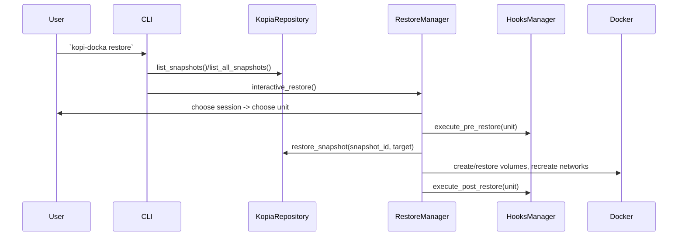
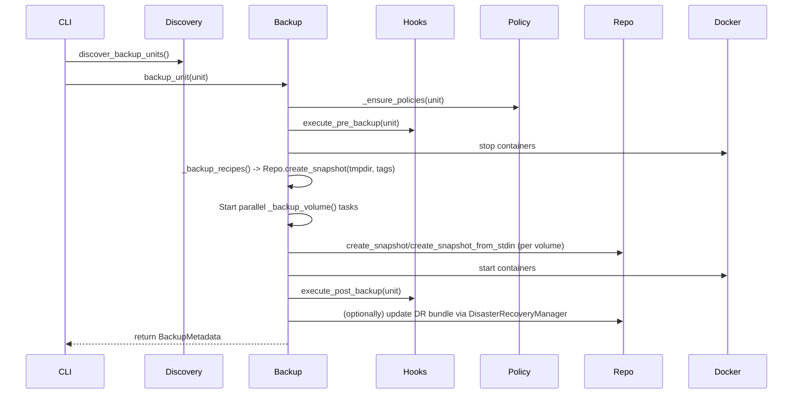
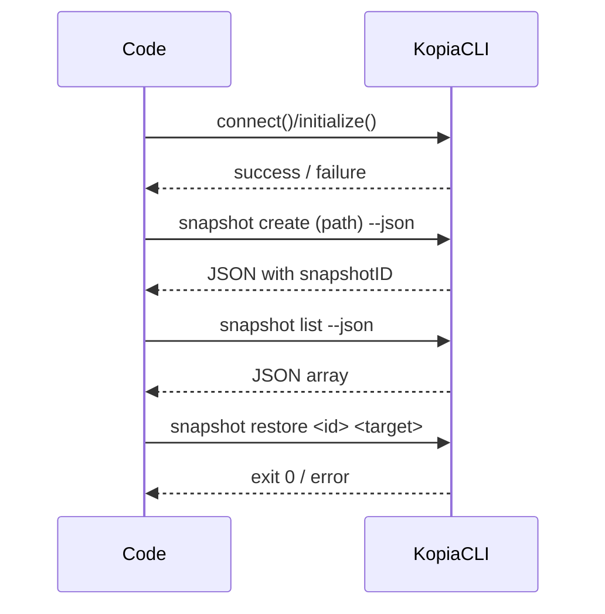
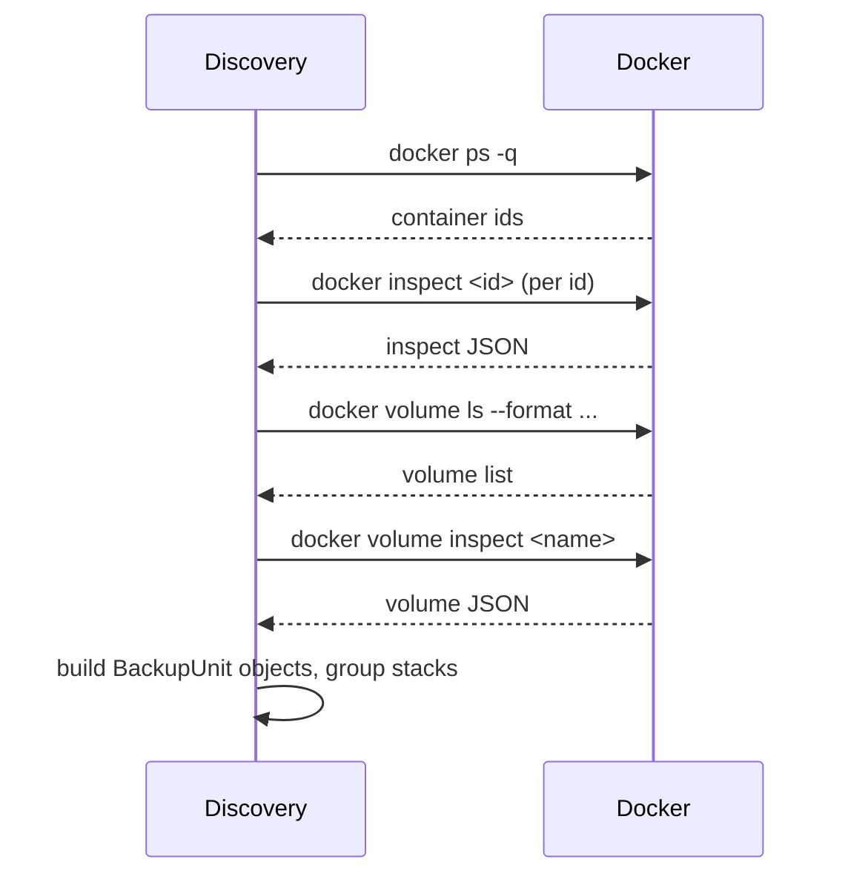
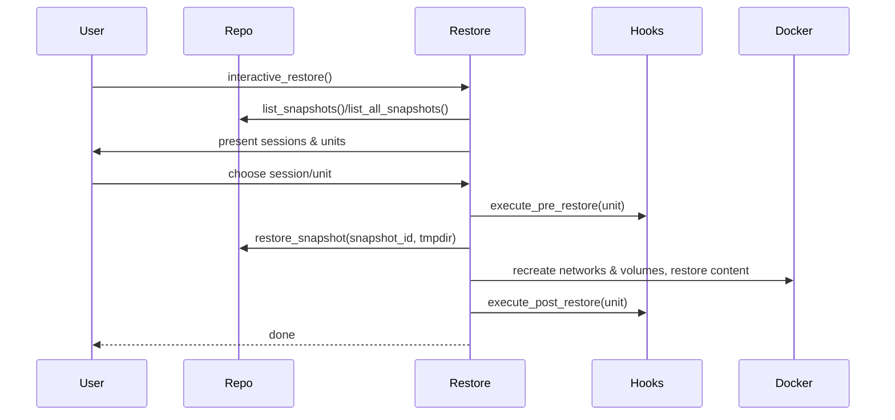

# Kopi‑Docka — Architecture Overview 📐

This document describes the architecture of Kopi‑Docka based on the *codebase* (no README/docs were used). It is written in English and structured so an automated system (AI) can reliably extract responsibilities, flows, and extension points.

---

## Summary ✅

Kopi‑Docka is a CLI-driven orchestration tool that performs cold backups of Docker-based units (stacks/standalone containers) using Kopia as the storage backend. Key responsibilities are: discovery of Docker units, orchestration of cold backups (stop → snapshot recipes → snapshot volumes → start), integration with Kopia, and restore via an interactive wizard. Note: Kopi‑Docka currently supports a single repository per host (see README for limitations).

---

## High-level components 🔧

- `CLI (typer)` — entrypoint: `kopi_docka.__main__`.
  - Registers top-level commands using `typer` and binds to modules in `kopi_docka.commands` (e.g. `backup_commands.register(app)`).
  - `initialize_context()` loads `Config` and enforces privilege checks (non-root allowed for safe commands only).

- `Config` — `kopi_docka.helpers.config.Config`.
  - Central source for runtime configuration, password handling (`get_password`/`set_password`), and convenience properties (`kopia_profile`, `backup_base_path`, `parallel_workers`, etc.).

- `Discovery` — `kopi_docka.cores.docker_discovery.DockerDiscovery`.
  - Discovers containers and volumes via Docker CLI (`docker ps`, `inspect`, `volume ls`), builds `types.BackupUnit` objects, detects DB containers and groups stacks vs standalone.

- `BackupManager` — `kopi_docka.cores.backup_manager.BackupManager`.
  - Orchestrates cold backups, executes hooks (`HooksManager`), stops/starts containers, performs recipe and volume snapshots, uploads to Kopia repository, sets policies via `KopiaPolicyManager` and optionally creates DR bundles.

- `RestoreManager` — `kopi_docka.cores.restore_manager.RestoreManager`.
  - Interactive (or non-interactive) restore wizard that finds restore points, lets user select a session/unit and restores recipes, networks and volumes.

- `Repository` — `kopi_docka.cores.repository_manager.KopiaRepository`.
  - Wrapper around Kopia CLI: connect, initialize, snapshot create (dir/stdin), list, restore, verify, maintenance, and helper `discover_machines()`.
  - Adds config file handling per profile and environment variables for Kopia.

- `Policy` — `kopi_docka.cores.kopia_policy_manager.KopiaPolicyManager`.
  - Sets global and target-specific Kopia policies (compression, retention).

- `Hooks` — `kopi_docka.cores.hooks_manager.HooksManager`.
  - Executes user scripts for `pre_backup`, `post_backup`, `pre_restore`, `post_restore` with timeout and environment variables.

- `Backends` — implementations under `kopi_docka.backends`.
  - `BackendBase` defines interface: `check_dependencies()`, `setup_interactive()`, `validate_config()`, `test_connection()`, `get_kopia_args()`, etc. Concrete implementations: `s3.py`, `rclone.py`, `local.py`, `gcs.py`, `azure.py`, `b2.py`, `sftp.py`, `tailscale.py`.

- `Helpers` — `kopi_docka.helpers` package.
  - Important modules: `ui_utils` (UI abstractions & helpers), `file_operations`, `system_utils` (OS detection & worker heuristics), `logging`, `constants`.

---

## Data models & tags (AI-friendly) 🧭

Key DTOs (in `kopi_docka.types`):

- `ContainerInfo`: id, name, image, status, labels, environment, volumes, compose_files, inspect_data, database_type
- `VolumeInfo`: name, driver, mountpoint, labels, size_bytes, container_ids
- `BackupUnit`: name, type (`stack` or `standalone`), containers, volumes, compose_files
- `BackupMetadata`: unit_name, timestamp, duration, backup_id (required), kopia_snapshot_ids, errors, backup_scope, backup_format (e.g. 'direct' — default since Kopi‑Docka v5.0; requires Kopia >= 0.13)

*Note:* In this doc, mentions of "v5.0+" refer to Kopi‑Docka project releases, not the Kopia CLI itself.
- `RestorePoint`: unit_name, timestamp, backup_id, lists of snapshot entries

Snapshot tagging (created by `BackupManager` / `KopiaRepository.create_snapshot`):
- `type`: `recipe` | `volume` | `networks`
- `unit`: backup unit name
- `backup_id`: unique id (UUID) for a run
- `timestamp`: ISO timestamp

These tags are the primary mechanism to reconstruct restore sessions and correlate snapshots.

---

## Main control flows (Mermaid diagrams) 🌊

### Backup flow (simplified sequence)

```mermaid
sequenceDiagram
    participant User
    participant CLI as `typer` CLI
    participant Discovery as DockerDiscovery
    participant Backup as BackupManager
    participant Hooks as HooksManager
    participant Repo as KopiaRepository

    User->>CLI: `kopi-docka backup`
    CLI->>Discovery: discover_backup_units()
    CLI->>Backup: BackupManager(cfg)
    Backup->>Hooks: execute_pre_backup(unit)
    Backup->>Docker: stop containers
    Backup->>Backup: _backup_recipes() → Repo.create_snapshot(tmpdir, tags)
    Backup->>Backup: _backup_volume(...) [parallel workers]
    Backup->>Repo: create_snapshot/create_snapshot_from_stdin
    Backup->>Docker: start containers
    Backup->>Hooks: execute_post_backup(unit)
    Backup-->>CLI: metadata (success|errors)
``` 



### Restore flow (interactive, simplified)



### Component relationships (graph)

```mermaid
graph LR
  CLI --> Config
  CLI --> Commands
  Commands --> BackupManager
  Commands --> RestoreManager
  BackupManager --> DockerDiscovery
  BackupManager --> HooksManager
  BackupManager --> KopiaRepository
  KopiaRepository --> Backends
  KopiaRepository --> KopiaPolicyManager
  HooksManager --> (user scripts)
  Helpers --> (logging, ui_utils, system_utils)
``` 

---

## Implementation details & important methods 🔬

- CLI
  - `kopi_docka.__main__`: registers commands and sets up context. `SAFE_COMMANDS` allow some commands to run without root.

- Discovery
  - `DockerDiscovery.discover_backup_units()` ⇒ returns `List[BackupUnit]`.
  - Uses labels `DOCKER_COMPOSE_PROJECT_LABEL` / `DOCKER_COMPOSE_CONFIG_LABEL` to group containers as stacks.

- BackupManager
  - Public: `backup_unit(unit: BackupUnit, backup_scope, update_recovery_bundle)` ⇒ returns `BackupMetadata`.
  - Steps inside: _ensure_policies(), execute pre-hook, stop containers, backup recipes, backup networks, backup volumes (parallel with ThreadPoolExecutor), start containers, execute post-hook, save metadata, optionally update DR bundle.
  - Volume backup modes: `create_snapshot` (direct directory snapshot / best) or `create_snapshot_from_stdin` (tar stream, deprecated).

- KopiaRepository
  - Core methods: `connect()`, `initialize()`, `create_snapshot(path, tags, exclude_patterns)`, `create_snapshot_from_stdin(stdin, dest_virtual_path, tags)`, `list_snapshots()`, `list_all_snapshots()`, `restore_snapshot()`, `verify_snapshot()`.
  - Adds profile/config management: `--config-file` handling and env vars (KOPIA_PASSWORD, KOPIA_CACHE_DIRECTORY).

- HooksManager
  - `execute_hook(hook_type, unit_name, timeout)` handles exec, captures stderr/stdout, sets env vars `KOPI_DOCKA_HOOK_TYPE` and `KOPI_DOCKA_UNIT_NAME`.

- Backend interface
  - `BackendBase` defines required behavior: dependency checks, interactive setup, validation, connection tests and `get_kopia_args()`.

- Error handling
  - Critical operations are wrapped in try/except, errors appended to `BackupMetadata.errors`.
  - Hooks failures cause backup to abort if pre-backup fails.

- Concurrency
  - Volume backups run in parallel with `ThreadPoolExecutor(max_workers=config.parallel_workers)`.

- Security & Privileges
  - Root required for most operations via `initialize_context()` (enforced), except safe commands.
  - Passwords: `Config.get_password()` returns password from `password_file` or plain config; `set_password(use_file=True)` stores a protected password file (`chmod 600`).

---

## Testing & Observability 🧪

- Unit & integration tests live in `tests/` (unit and integration subfolders). Look for tests that exercise `backup_commands`, `repository_manager` and `service_templates`.
- Logging via `helpers.logging` and structured `logger` usage across managers.
- Metadata JSON for each run is written into `Config.backup_base_path / 'metadata'` to allow offline inspection.

---

## Extension points / Where to hook new features ➕

- Add new storage backend: Implement `BackendBase` and add an entry in `kopi_docka.backends` and wire into setup flows.
- New hook types: Add constants in `helpers.constants`, extend `HooksManager` and call from managers where appropriate.
- Alternate backup format: modify `BackupManager._backup_volume_direct` or add a new dispatcher branch.

---

## For AI consumption (tips) 🤖

- Look at `types.BackupUnit`, `types.BackupMetadata` and snapshot tags to reconstruct sessions: snapshots with `tags['type'] == 'recipe'` and shared `backup_id` are part of the same run.
- Use `KopiaRepository.list_snapshots()` (JSON) and filter by `tags` to list relevant snapshots.
- Use `DockerDiscovery` to infer unit composition. Data needed for restore: `compose_files`, `ContainerInfo.inspect_data`, and `VolumeInfo.mountpoint`.

---

## Files to inspect for details 📁

- Core: `kopi_docka/__main__.py`, `kopi_docka/types.py`
- Managers: `kopi_docka/cores/*.py` (especially `backup_manager.py`, `restore_manager.py`, `repository_manager.py`, `docker_discovery.py`, `hooks_manager.py`)
- Backends: `kopi_docka/backends/*.py` (see `BackendBase` for contract)
- Helpers: `kopi_docka/helpers/*.py` (notably `config.py`, `ui_utils.py`, `file_operations.py`)

---

## Component details — Classes & key methods 🔎

Below are compact, AI-friendly class → method tables and short notes for the most important components.

### BackupManager (kopi_docka.cores.backup_manager.BackupManager)

| Method | Signature | Purpose |
|---|---|---|
| __init__ | (config: Config) | Initialize managers (KopiaRepository, KopiaPolicyManager, HooksManager) and timeouts.
| backup_unit | (unit: BackupUnit, backup_scope: str = 'standard', update_recovery_bundle: bool = None) -> BackupMetadata | Orchestrate full cold backup and return metadata.
| _stop_containers | (containers: List[ContainerInfo]) -> None | Stop containers gracefully with timeout.
| _start_containers | (containers: List[ContainerInfo]) -> None | Start containers and wait for healthchecks.
| _backup_recipes | (unit: BackupUnit, backup_id: str) -> Optional[str] | Save compose files + container inspect (redact env) and snapshot via Repo.
| _backup_networks | (unit: BackupUnit, backup_id: str) -> (Optional[str], int) | Inspect and snapshot custom Docker networks.
| _backup_volume | (volume: VolumeInfo, unit: BackupUnit, backup_id: str) -> Optional[str] | Dispatcher to _backup_volume_direct/_backup_volume_tar.
| _backup_volume_direct | (volume, unit, backup_id) -> Optional[str] | Preferred direct Kopia snapshot of filesystem path.
| _backup_volume_tar | (volume, unit, backup_id) -> Optional[str] | Legacy tar → Kopia stdin snapshot (deprecated).
| _save_metadata | (metadata: BackupMetadata) -> None | Persist metadata JSON for the run.
| _ensure_policies | (unit: BackupUnit) -> None | Apply per-target retention via KopiaPolicyManager.

---

### KopiaRepository (kopi_docka.cores.repository_manager.KopiaRepository)

| Method | Signature | Purpose |
|---|---|---|
| __init__ | (config: Config) | Read `kopia_params` and profile.
| status | (json_output: bool = True, verbose: bool = False) -> Union[str, dict] | Query repository status (wraps `kopia repository status`).
| is_connected / is_initialized | () -> bool | Quick checks for Kopia availability/connection.
| connect | () -> None | Connect to an existing repo (idempotent).
| initialize | () -> None | Create & connect repo, apply defaults.
| create_snapshot | (path: str, tags: Optional[Dict[str,str]] = None, exclude_patterns: Optional[List[str]] = None) -> str | Create directory snapshot and return snapshot ID.
| create_snapshot_from_stdin | (stdin: IO[bytes], dest_virtual_path: str, tags: Optional[Dict]) -> str | Create stdin (tar) snapshot (deprecated).
| list_snapshots / list_all_snapshots | (tag_filter: Optional[Dict]) -> List[Dict] | List snapshots and optionally filter by tags.
| restore_snapshot | (snapshot_id: str, target_path: str) -> None | Restore snapshot to target dir.
| verify_password / set_repo_password | (password) -> bool/None | Password management helper wrappers.

---

### RestoreManager (kopi_docka.cores.restore_manager.RestoreManager)

| Method | Signature | Purpose |
|---|---|---|
| interactive_restore | () -> None | Main interactive flow: checks, find points, user choices, restore steps.
| advanced_interactive_restore | () -> None | Cross-machine restore: lists machines from repository.
| _find_restore_points | () -> List[RestorePoint] | Build RestorePoint objects by querying Kopia snapshots.
| _restore_unit | (point: RestorePoint) -> None | Restore recipes, networks, and selected volumes.
| (hooks usage) | execute_pre_restore / execute_post_restore via HooksManager | Hooks are invoked by the manager where needed.

---

### DockerDiscovery (kopi_docka.cores.docker_discovery.DockerDiscovery)

| Method | Signature | Purpose |
|---|---|---|
| discover_backup_units | () -> List[BackupUnit] | High-level discovery for CLI commands.
| _discover_containers | () -> List[ContainerInfo] | `docker ps` → `inspect` → ContainerInfo objects.
| _discover_volumes | () -> List[VolumeInfo] | `docker volume ls` and `inspect` → VolumeInfo objects.
| _group_into_units | (containers, volumes) -> List[BackupUnit] | Group by compose project label (stacks) or standalone.

---

### HooksManager (kopi_docka.cores.hooks_manager.HooksManager)

| Method | Signature | Purpose |
|---|---|---|
| execute_hook | (hook_type: str, unit_name: str = None, timeout: int = 300) -> bool | Execute configured script, capture stdout/stderr, enforce timeout.
| execute_pre_backup / execute_post_backup / execute_pre_restore / execute_post_restore | (unit_name) -> bool | Convenience wrappers for common hook points.

---

### BackendBase & concrete backends (kopi_docka.backends)

| Class / Method | Purpose |
|---|---|
| BackendBase | Abstract contract: `check_dependencies()`, `install_dependencies()`, `setup_interactive()`, `validate_config()`, `test_connection()`, `get_kopia_args()`.
| s3/rclone/gcs/etc. | Provide backend-specific `get_kopia_args()` and credential handling, plus interactive setup.

---

## Additional sequence diagrams (detailed) 🔁

### BackupManager detailed sequence



### KopiaRepository lifecycle



### DockerDiscovery flow



### RestoreManager detailed sequence



---

## Notes for automation & AI parsing 🤖

- Use snapshot `tags` (type, unit, backup_id, timestamp) to reconstruct sessions and link recipes ↔ volumes.
- Data model names (`BackupUnit`, `ContainerInfo`, `VolumeInfo`, `BackupMetadata`) are stable anchors for automated tools.
- Prefer `KopiaRepository.create_snapshot(path)` when possible (better deduplication) — `create_snapshot_from_stdin` is deprecated.

---

## Next steps / Actions ✍️

- I can produce a machine-readable JSON export mapping components → classes → public methods (useful for an LLM to ingest). ✅
- I can add these expanded sections into `docs/` and open a PR. ✅
- I can also generate a minimal site-friendly diagram (SVG) if you prefer a rendered artifact. ✅

Which of the above would you like me to do next? 🚀
