# Kopi‑Docka — Architecture Overview 📐

This document describes the architecture of Kopi‑Docka based on the *codebase* (no README/docs were used). It is written in English and structured so an automated system (AI) can reliably extract responsibilities, flows, and extension points.

---

## Summary ✅

Kopi‑Docka is a CLI-driven orchestration tool that performs cold backups of Docker-based units (stacks/standalone containers) using Kopia as the storage backend. Key responsibilities are: discovery of Docker units, orchestration of cold backups (stop → snapshot recipes → snapshot volumes → start), integration with Kopia, and restore via an interactive wizard. Note: Kopi‑Docka currently supports a single repository per host (see README for limitations).

---

## High-level components 🔧

- `CLI (typer)` — entrypoint: `kopi_docka.__main__`.
  - Registers top-level commands using `typer` and binds to modules in `kopi_docka.commands` (e.g. `backup_commands.register(app)`).
  - `initialize_context()` loads `Config` and enforces privilege checks (non-root allowed for safe commands only).

- `Config` — `kopi_docka.helpers.config.Config`.
  - Central source for runtime configuration, password handling (`get_password`/`set_password`), and convenience properties (`kopia_profile`, `backup_base_path`, `parallel_workers`, etc.).

- `Discovery` — `kopi_docka.cores.docker_discovery.DockerDiscovery`.
  - Discovers containers and volumes via Docker CLI (`docker ps`, `inspect`, `volume ls`), builds `types.BackupUnit` objects, detects DB containers and groups stacks vs standalone.

- `BackupManager` — `kopi_docka.cores.backup_manager.BackupManager`.
  - Orchestrates cold backups, executes hooks (`HooksManager`), stops/starts containers, performs recipe and volume snapshots, uploads to Kopia repository, sets policies via `KopiaPolicyManager` and optionally creates DR bundles.

- `RestoreManager` — `kopi_docka.cores.restore_manager.RestoreManager`.
  - Interactive (or non-interactive) restore wizard that finds restore points, lets user select a session/unit and restores recipes, networks and volumes.

- `Repository` — `kopi_docka.cores.repository_manager.KopiaRepository`.
  - Wrapper around Kopia CLI: connect, initialize, snapshot create (dir/stdin), list, restore, verify, maintenance, and helper `discover_machines()`.
  - Adds config file handling per profile and environment variables for Kopia.

- `Policy` — `kopi_docka.cores.kopia_policy_manager.KopiaPolicyManager`.
  - Sets global and target-specific Kopia policies (compression, retention).

- `Hooks` — `kopi_docka.cores.hooks_manager.HooksManager`.
  - Executes user scripts for `pre_backup`, `post_backup`, `pre_restore`, `post_restore` with timeout and environment variables.

- `Backends` — implementations under `kopi_docka.backends`.
  - `BackendBase` defines interface: `check_dependencies()`, `setup_interactive()`, `validate_config()`, `test_connection()`, `get_kopia_args()`, etc. Concrete implementations: `s3.py`, `rclone.py`, `local.py`, `gcs.py`, `azure.py`, `b2.py`, `sftp.py`, `tailscale.py`.

- `Helpers` — `kopi_docka.helpers` package.
  - Important modules: `ui_utils` (UI abstractions & helpers), `file_operations`, `system_utils` (OS detection & worker heuristics), `logging`, `constants`.

---

## Data models & tags (AI-friendly) 🧭

Key DTOs (in `kopi_docka.types`):

- `ContainerInfo`: id, name, image, status, labels, environment, volumes, compose_files, inspect_data, database_type
- `VolumeInfo`: name, driver, mountpoint, labels, size_bytes, container_ids
- `BackupUnit`: name, type (`stack` or `standalone`), containers, volumes, compose_files
- `BackupMetadata`: unit_name, timestamp, duration, backup_id (required), kopia_snapshot_ids, errors, backup_scope, backup_format (e.g. 'direct' — default since Kopi‑Docka v5.0; requires Kopia >= 0.13)

*Note:* In this doc, mentions of "v5.0+" refer to Kopi‑Docka project releases, not the Kopia CLI itself.
- `RestorePoint`: unit_name, timestamp, backup_id, lists of snapshot entries

Snapshot tagging (created by `BackupManager` / `KopiaRepository.create_snapshot`):
- `type`: `recipe` | `volume` | `networks`
- `unit`: backup unit name
- `backup_id`: unique id (UUID) for a run
- `timestamp`: ISO timestamp

These tags are the primary mechanism to reconstruct restore sessions and correlate snapshots.

---

## Main control flows (Mermaid diagrams) 🌊

### Backup flow (simplified sequence)

```mermaid
sequenceDiagram
    participant User
    participant CLI as `typer` CLI
    participant Discovery as DockerDiscovery
    participant Backup as BackupManager
    participant Hooks as HooksManager
    participant Repo as KopiaRepository

    User->>CLI: `kopi-docka backup`
    CLI->>Discovery: discover_backup_units()
    CLI->>Backup: BackupManager(cfg)
    Backup->>Hooks: execute_pre_backup(unit)
    Backup->>Docker: stop containers
    Backup->>Backup: _backup_recipes() → Repo.create_snapshot(staging_dir, tags)
    Note over Backup: Stable path: /var/cache/kopi-docka/staging/recipes/<unit>/
    Backup->>Backup: _backup_volume(...) [parallel workers]
    Backup->>Repo: create_snapshot/create_snapshot_from_stdin
    Backup->>Docker: start containers
    Backup->>Hooks: execute_post_backup(unit)
    Backup-->>CLI: metadata (success|errors)
``` 



### Restore flow (interactive, simplified)


### Component relationships (graph)


---

## Implementation details & important methods 🔬

- CLI
  - `kopi_docka.__main__`: registers commands and sets up context. `SAFE_COMMANDS` allow some commands to run without root.

- Discovery
  - `DockerDiscovery.discover_backup_units()` ⇒ returns `List[BackupUnit]`.
  - Uses labels `DOCKER_COMPOSE_PROJECT_LABEL` / `DOCKER_COMPOSE_CONFIG_LABEL` to group containers as stacks.

- BackupManager
  - Public: `backup_unit(unit: BackupUnit, backup_scope, update_recovery_bundle)` ⇒ returns `BackupMetadata`.
  - Steps inside: _ensure_policies(), execute pre-hook, stop containers, backup recipes, backup networks, backup volumes (parallel with ThreadPoolExecutor), start containers, execute post-hook, save metadata, optionally update DR bundle.
  - Volume backup modes: `create_snapshot` (direct directory snapshot / best) or `create_snapshot_from_stdin` (tar stream, deprecated).
  - **Stable staging paths (v5.3.0+):** Recipe and network backups use fixed staging directories (`/var/cache/kopi-docka/staging/recipes/<unit>/` and `/var/cache/kopi-docka/staging/networks/<unit>/`) instead of random temp dirs. This enables Kopia retention policies to work correctly by ensuring consistent snapshot source paths across backups.

- KopiaRepository
  - Core methods: `connect()`, `initialize()`, `create_snapshot(path, tags, exclude_patterns)`, `create_snapshot_from_stdin(stdin, dest_virtual_path, tags)`, `list_snapshots()`, `list_all_snapshots()`, `restore_snapshot()`, `verify_snapshot()`.
  - Adds profile/config management: `--config-file` handling and env vars (KOPIA_PASSWORD, KOPIA_CACHE_DIRECTORY).

- HooksManager
  - `execute_hook(hook_type, unit_name, timeout)` handles exec, captures stderr/stdout, sets env vars `KOPI_DOCKA_HOOK_TYPE` and `KOPI_DOCKA_UNIT_NAME`.

- Backend interface
  - `BackendBase` defines required behavior: dependency checks, interactive setup, validation, connection tests and `get_kopia_args()`.

- Error handling
  - Critical operations are wrapped in try/except, errors appended to `BackupMetadata.errors`.
  - Hooks failures cause backup to abort if pre-backup fails.

- Concurrency
  - Volume backups run in parallel with `ThreadPoolExecutor(max_workers=config.parallel_workers)`.

- Security & Privileges
  - Root required for most operations via `initialize_context()` (enforced), except safe commands.
  - Passwords: `Config.get_password()` returns password from `password_file` or plain config; `set_password(use_file=True)` stores a protected password file (`chmod 600`).

---

## Testing & Observability 🧪

- Unit & integration tests live in `tests/` (unit and integration subfolders). Look for tests that exercise `backup_commands`, `repository_manager` and `service_templates`.
- Logging via `helpers.logging` and structured `logger` usage across managers.
- Metadata JSON for each run is written into `Config.backup_base_path / 'metadata'` to allow offline inspection.

---

## Extension points / Where to hook new features ➕

- Add new storage backend: Implement `BackendBase` and add an entry in `kopi_docka.backends` and wire into setup flows.
- New hook types: Add constants in `helpers.constants`, extend `HooksManager` and call from managers where appropriate.
- Alternate backup format: modify `BackupManager._backup_volume_direct` or add a new dispatcher branch.

---

## For AI consumption (tips) 🤖

- Look at `types.BackupUnit`, `types.BackupMetadata` and snapshot tags to reconstruct sessions: snapshots with `tags['type'] == 'recipe'` and shared `backup_id` are part of the same run.
- Use `KopiaRepository.list_snapshots()` (JSON) and filter by `tags` to list relevant snapshots.
- Use `DockerDiscovery` to infer unit composition. Data needed for restore: `compose_files`, `ContainerInfo.inspect_data`, and `VolumeInfo.mountpoint`.

---

## Files to inspect for details 📁

- Core: `kopi_docka/__main__.py`, `kopi_docka/types.py`
- Managers: `kopi_docka/cores/*.py` (especially `backup_manager.py`, `restore_manager.py`, `repository_manager.py`, `docker_discovery.py`, `hooks_manager.py`)
- Backends: `kopi_docka/backends/*.py` (see `BackendBase` for contract)
- Helpers: `kopi_docka/helpers/*.py` (notably `config.py`, `ui_utils.py`, `file_operations.py`)

---

## Component details — Classes & key methods 🔎

Below are compact, AI-friendly class → method tables and short notes for the most important components.

### BackupManager (kopi_docka.cores.backup_manager.BackupManager)

| Method | Signature | Purpose |
|---|---|---|
| __init__ | (config: Config) | Initialize managers (KopiaRepository, KopiaPolicyManager, HooksManager) and timeouts.
| backup_unit | (unit: BackupUnit, backup_scope: str = 'standard', update_recovery_bundle: bool = None) -> BackupMetadata | Orchestrate full cold backup and return metadata.
| _stop_containers | (containers: List[ContainerInfo]) -> None | Stop containers gracefully with timeout.
| _start_containers | (containers: List[ContainerInfo]) -> None | Start containers and wait for healthchecks.
| _backup_recipes | (unit: BackupUnit, backup_id: str) -> Optional[str] | Save compose files + container inspect (redact env) to stable staging dir and snapshot via Repo. Uses `/var/cache/kopi-docka/staging/recipes/<unit-name>/` (v5.3.0+).
| _backup_networks | (unit: BackupUnit, backup_id: str) -> (Optional[str], int) | Inspect and snapshot custom Docker networks to stable staging dir. Uses `/var/cache/kopi-docka/staging/networks/<unit-name>/` (v5.3.0+).
| _backup_volume | (volume: VolumeInfo, unit: BackupUnit, backup_id: str) -> Optional[str] | Dispatcher to _backup_volume_direct/_backup_volume_tar.
| _backup_volume_direct | (volume, unit, backup_id) -> Optional[str] | Preferred direct Kopia snapshot of filesystem path.
| _backup_volume_tar | (volume, unit, backup_id) -> Optional[str] | Legacy tar → Kopia stdin snapshot (deprecated).
| _save_metadata | (metadata: BackupMetadata) -> None | Persist metadata JSON for the run.
| _ensure_policies | (unit: BackupUnit) -> None | Apply per-target retention via KopiaPolicyManager.

---

### KopiaRepository (kopi_docka.cores.repository_manager.KopiaRepository)

| Method | Signature | Purpose |
|---|---|---|
| __init__ | (config: Config) | Read `kopia_params` and profile.
| status | (json_output: bool = True, verbose: bool = False) -> Union[str, dict] | Query repository status (wraps `kopia repository status`).
| is_connected / is_initialized | () -> bool | Quick checks for Kopia availability/connection.
| connect | () -> None | Connect to an existing repo (idempotent).
| initialize | () -> None | Create & connect repo, apply defaults.
| create_snapshot | (path: str, tags: Optional[Dict[str,str]] = None, exclude_patterns: Optional[List[str]] = None) -> str | Create directory snapshot and return snapshot ID.
| create_snapshot_from_stdin | (stdin: IO[bytes], dest_virtual_path: str, tags: Optional[Dict]) -> str | Create stdin (tar) snapshot (deprecated).
| list_snapshots / list_all_snapshots | (tag_filter: Optional[Dict]) -> List[Dict] | List snapshots and optionally filter by tags.
| restore_snapshot | (snapshot_id: str, target_path: str) -> None | Restore snapshot to target dir.
| verify_password / set_repo_password | (password) -> bool/None | Password management helper wrappers.

---

### RestoreManager (kopi_docka.cores.restore_manager.RestoreManager)

| Method | Signature | Purpose |
|---|---|---|
| interactive_restore | () -> None | Main interactive flow: checks, find points, user choices, restore steps.
| advanced_interactive_restore | () -> None | Cross-machine restore: lists machines from repository.
| _find_restore_points | () -> List[RestorePoint] | Build RestorePoint objects by querying Kopia snapshots.
| _restore_unit | (point: RestorePoint) -> None | Restore recipes, networks, and selected volumes.
| (hooks usage) | execute_pre_restore / execute_post_restore via HooksManager | Hooks are invoked by the manager where needed.

---

### DockerDiscovery (kopi_docka.cores.docker_discovery.DockerDiscovery)

| Method | Signature | Purpose |
|---|---|---|
| discover_backup_units | () -> List[BackupUnit] | High-level discovery for CLI commands.
| _discover_containers | () -> List[ContainerInfo] | `docker ps` → `inspect` → ContainerInfo objects.
| _discover_volumes | () -> List[VolumeInfo] | `docker volume ls` and `inspect` → VolumeInfo objects.
| _group_into_units | (containers, volumes) -> List[BackupUnit] | Group by compose project label (stacks) or standalone.

---

### HooksManager (kopi_docka.cores.hooks_manager.HooksManager)

| Method | Signature | Purpose |
|---|---|---|
| execute_hook | (hook_type: str, unit_name: str = None, timeout: int = 300) -> bool | Execute configured script, capture stdout/stderr, enforce timeout.
| execute_pre_backup / execute_post_backup / execute_pre_restore / execute_post_restore | (unit_name) -> bool | Convenience wrappers for common hook points.

---

### BackendBase & concrete backends (kopi_docka.backends)

| Class / Method | Purpose |
|---|---|
| BackendBase | Abstract contract: `check_dependencies()`, `install_dependencies()`, `setup_interactive()`, `validate_config()`, `test_connection()`, `get_kopia_args()`.
| s3/rclone/gcs/etc. | Provide backend-specific `get_kopia_args()` and credential handling, plus interactive setup.

---

## SafeExitManager — Two-Layer Exit Safety Architecture 🛡️

### Overview

**SafeExitManager** is a singleton component that ensures graceful cleanup when Kopi-Docka operations are interrupted (SIGINT/SIGTERM). It uses a two-layer architecture to prevent:
- Containers staying stopped after backup abort → production outage
- Zombie subprocess processes → resource leaks
- Temp directories accumulating → disk space leaks
- Kopia locks staying held → blocked operations
- Incomplete DR archives → confusion

### Two-Layer Architecture

```mermaid
graph TB
    subgraph "Application Layer"
        BM[BackupManager]
        RM[RestoreManager]
        DRM[DisasterRecoveryManager]
        REPO[RepositoryManager]
        HM[HooksManager]
    end

    subgraph "Strategy Layer (SafeExitManager)"
        SEM[SafeExitManager Core<br/>Signal Handler]
        SCH[ServiceContinuityHandler<br/>Priority: 10]
        DSH[DataSafetyHandler<br/>Priority: 20]
        CH[CleanupHandler<br/>Priority: 50]

        SEM --> SCH
        SEM --> DSH
        SEM --> CH
    end

    subgraph "Process Layer (run_command)"
        RC[run_command<br/>subprocess tracking]
        TRACK[Process Registry<br/>{cleanup_id: (pid, name)}]

        RC --> TRACK
    end

    BM --> SCH
    BM --> RC
    RM --> DSH
    RM --> RC
    DRM --> CH
    DRM --> RC
    REPO --> RC
    HM --> RC

    style SEM fill:#ff6b6b
    style SCH fill:#4ecdc4
    style DSH fill:#45b7d1
    style CH fill:#96ceb4
    style RC fill:#ffeaa7
```

### Layer Separation of Concerns

| Responsibility | Process Layer | Strategy Layer |
|----------------|---------------|----------------|
| **Terminate subprocesses** | ✅ Automatic | ❌ |
| **Zombie prevention** | ✅ SIGTERM → SIGKILL | ❌ |
| **Container restart/stop** | ❌ | ✅ Context-aware |
| **Temp file cleanup** | ❌ | ✅ Context-aware |
| **Registration** | ✅ Auto (all run_command) | ✅ Manual (per manager) |
| **Coverage** | All subprocesses | Specific operations |

### Process Layer — Automatic Subprocess Tracking

**Implementation**: `kopi_docka.helpers.ui_utils.run_command()`

Every subprocess launched via `run_command()` is automatically tracked:

```python
def run_command(cmd, description, timeout=None, ...):
    """Execute command with automatic subprocess tracking."""
    from ..cores.safe_exit_manager import SafeExitManager

    safe_exit = SafeExitManager.get_instance()
    cleanup_id = None

    try:
        # Start process with Popen (instead of subprocess.run)
        process = subprocess.Popen(cmd_list, ...)

        # Register with SafeExitManager
        cleanup_id = safe_exit.register_process(process.pid, cmd_str[:50])

        # Wait for completion
        stdout, stderr = process.communicate(timeout=timeout)

        # ... error handling ...
    finally:
        # Always deregister (even on exception)
        if cleanup_id:
            safe_exit.unregister_process(cleanup_id)
```

**Tracked Process Registry**:
```python
{
    "uuid-1234": TrackedProcess(pid=12345, name="docker stop webapp", registered_at=1735567890.123),
    "uuid-5678": TrackedProcess(pid=12346, name="kopia snapshot create", registered_at=1735567891.456),
}
```

**On SIGINT/SIGTERM**:
1. First pass: Send SIGTERM to all tracked PIDs (graceful)
2. Wait 5 seconds
3. Second pass: Send SIGKILL to survivors (force)
4. Clear registry

### Strategy Layer — Context-Aware Handlers

**Implementation**: `kopi_docka.cores.safe_exit_manager.SafeExitManager`

Three handler types with different priorities (lower = runs first):

#### 1. ServiceContinuityHandler (Priority: 10)

**Purpose**: Restart containers after backup abort (prevent production outage)

**Used by**: `BackupManager`

**Behavior**:
- Tracks containers that were stopped for backup
- On abort: Restarts containers in **LIFO order** (reverse of stop order)
- Timeout: 30s per container
- Errors logged but don't block other containers

**Integration**:
```python
# In BackupManager.__init__
self.service_continuity = ServiceContinuityHandler()
SafeExitManager.get_instance().register_handler(self.service_continuity)

# In _stop_containers()
self.service_continuity.register_container(container_id, container_name)

# In _start_containers()
self.service_continuity.unregister_container(container_id)
```

#### 2. DataSafetyHandler (Priority: 20)

**Purpose**: Keep containers stopped during restore abort (data integrity)

**Used by**: `RestoreManager`

**Behavior**:
- Tracks containers that were stopped for restore
- Tracks temp directories created during restore
- On abort:
  - Containers stay STOPPED (intentional)
  - Temp dirs cleaned up
  - Warning logged for manual restart

**Integration**:
```python
# In RestoreManager._restore_unit()
handler = DataSafetyHandler()
SafeExitManager.get_instance().register_handler(handler)

handler.register_stopped_container(container_name)
handler.register_temp_dir(temp_restore_dir)

# ... restore operations ...

SafeExitManager.get_instance().unregister_handler(handler)
```

#### 3. CleanupHandler (Priority: 50)

**Purpose**: Generic cleanup callbacks (temp dirs, incomplete files)

**Used by**: `DisasterRecoveryManager`, `RepositoryManager`

**Behavior**:
- Accepts arbitrary cleanup callbacks
- Executes callbacks on abort
- Error-tolerant (try/except per callback)

**Integration**:
```python
# In DisasterRecoveryManager.create_recovery_bundle()
cleanup_handler = CleanupHandler("dr_cleanup")
cleanup_handler.register_cleanup(
    "temp_dir",
    lambda: shutil.rmtree(temp_dir) if os.path.exists(temp_dir) else None
)
cleanup_handler.register_cleanup(
    "incomplete_archive",
    lambda: os.remove(bundle_path) if os.path.exists(bundle_path) else None
)

SafeExitManager.get_instance().register_handler(cleanup_handler)

# ... DR operations ...

SafeExitManager.get_instance().unregister_handler(cleanup_handler)
```

### Signal Handling Flow

```mermaid
sequenceDiagram
    participant User
    participant OS
    participant SEM as SafeExitManager
    participant PL as Process Layer
    participant SL as Strategy Layer
    participant Docker

    User->>OS: Ctrl+C (SIGINT)
    OS->>SEM: signal_handler(SIGINT)

    alt Cleanup already in progress
        SEM->>OS: Force exit (128+signum)
    end

    SEM->>SEM: Set cleanup_in_progress flag

    Note over SEM,PL: LAYER 1: Process Termination
    SEM->>PL: _terminate_all_processes()
    PL->>PL: SIGTERM → all tracked PIDs
    PL->>PL: wait 5s
    PL->>PL: SIGKILL → survivors
    PL->>PL: Clear process registry

    Note over SEM,SL: LAYER 2: Strategy Handlers
    SEM->>SEM: Sort handlers by priority

    SEM->>SL: ServiceContinuityHandler.cleanup()
    SL->>Docker: docker start (LIFO order)
    Docker-->>SL: containers UP

    SEM->>SL: DataSafetyHandler.cleanup()
    SL->>SL: Remove temp dirs
    SL->>SL: Log warning (containers stopped)

    SEM->>SL: CleanupHandler.cleanup()
    SL->>SL: Execute callbacks

    SEM->>OS: sys.exit(130 or 143)
```



### Implementation: SafeExitManager Core

**File**: `kopi_docka/cores/safe_exit_manager.py`

**Key Methods**:

| Method | Layer | Purpose |
|--------|-------|---------|
| `install_handlers()` | Core | Install SIGINT/SIGTERM handlers (call once at startup) |
| `_signal_handler(signum, frame)` | Core | Signal callback → cleanup → exit |
| `register_process(pid, name)` | Process | Add subprocess to tracking (returns cleanup_id) |
| `unregister_process(cleanup_id)` | Process | Remove subprocess from tracking |
| `_terminate_all_processes()` | Process | SIGTERM → wait → SIGKILL all tracked PIDs |
| `register_handler(handler)` | Strategy | Add exit handler (sorted by priority) |
| `unregister_handler(handler)` | Strategy | Remove exit handler |
| `_run_all_handlers()` | Strategy | Execute handlers in priority order |

**Thread Safety**:
- `_lock` (class-level): Singleton creation
- `_process_lock`: Process registry access
- `_handler_lock`: Handler registry access
- `_cleanup_in_progress`: Flag prevents nested cleanup

**systemd Integration**:
```python
# Optional import (works without systemd)
try:
    from ..helpers.service_manager import sd_notify_stopping, sd_notify_watchdog
    HAS_SD_NOTIFY = True
except ImportError:
    HAS_SD_NOTIFY = False

def _signal_handler(self, signum, frame):
    # ... setup ...

    if HAS_SD_NOTIFY:
        sd_notify_stopping("Emergency cleanup in progress")

    self._terminate_all_processes()

    if HAS_SD_NOTIFY:
        sd_notify_watchdog()  # Reset watchdog before handlers

    self._run_all_handlers()
    # ... exit ...
```

### Component Integration Summary

| Manager | Uses Process Layer | Uses Strategy Layer | Handler Type |
|---------|-------------------|---------------------|--------------|
| **BackupManager** | ✅ (all docker/kopia calls) | ✅ | ServiceContinuityHandler |
| **RestoreManager** | ✅ (all docker/kopia calls) | ✅ | DataSafetyHandler |
| **RepositoryManager** | ✅ (all kopia calls) | ❌ | None (process layer sufficient) |
| **DisasterRecoveryManager** | ✅ (openssl subprocess) | ✅ | CleanupHandler |
| **HooksManager** | ✅ (hook subprocess) | ❌ | None (process layer sufficient) |

**Key Insight**: Process Layer provides baseline zombie prevention for ALL managers. Strategy Layer adds context-aware cleanup only where needed.

### Installation & Lifecycle

**Startup** (`kopi_docka/__main__.py`):
```python
def main():
    # Install signal handlers BEFORE any operations
    SafeExitManager.get_instance().install_handlers()

    # ... rest of CLI setup ...
    app()
```

**Manager Pattern** (example: BackupManager):
```python
class BackupManager:
    def __init__(self, config: Config):
        self.service_continuity = ServiceContinuityHandler()
        SafeExitManager.get_instance().register_handler(self.service_continuity)
        # Handler stays registered for entire BackupManager lifetime

    def _stop_containers(self, containers):
        for container in containers:
            run_command(["docker", "stop", container.id], ...)  # Auto-tracked
            self.service_continuity.register_container(container.id, container.name)

    def _start_containers(self, containers):
        for container in containers:
            run_command(["docker", "start", container.id], ...)  # Auto-tracked
            self.service_continuity.unregister_container(container.id)
```

### Edge Cases & Known Limitations

| Edge Case | Behavior | Mitigation |
|-----------|----------|------------|
| **SIGKILL (kill -9)** | Not catchable - no cleanup runs | Document: Use SIGTERM instead |
| **Double SIGINT** | First → cleanup, Second → force exit(128+signum) | `_cleanup_in_progress` flag |
| **Restore on new hardware** | Container doesn't exist for restart | Graceful skip in handlers (try/except) |
| **Network failure during cleanup** | Container restart may fail | Logged as error, doesn't block other containers |
| **Nested run_command during cleanup** | Not re-tracked (cleanup phase) | Acceptable - cleanup operations are simple |
| **Handler exception** | Logged, doesn't block other handlers | try/except per handler in `_run_all_handlers()` |

### Testing Strategy

**Unit Tests** (`tests/unit/test_cores/test_safe_exit_manager.py`):
- Singleton pattern
- Process register/unregister
- Signal handler installation
- Handler priority sorting
- Thread safety (concurrent register/unregister)

**Integration Tests** (`tests/integration/test_safe_exit_*.py`):
- Backup abort → containers restart
- Restore abort → containers stay stopped
- DR abort → temp cleanup
- subprocess termination (SIGTERM → SIGKILL)

**Manual Testing**:
```bash
# Backup abort
sudo kopi-docka backup
# Press Ctrl+C during volume backup
docker ps  # Should show containers UP

# Restore abort
sudo kopi-docka restore
# Press Ctrl+C during restore
docker ps  # Should show containers DOWN (intentional)

# DR abort
sudo kopi-docka disaster-recovery
# Press Ctrl+C during bundle creation
ls -la /tmp/kopi-docka-recovery-*  # Should NOT exist
```

### Key Learnings from Implementation

1. **subprocess.run() → subprocess.Popen()**: Required for PID registration before process completion
2. **LIFO container restart**: Safer for dependency chains (reverse stop order)
3. **finally blocks NOT interrupt-safe**: Signal handlers bypass `finally` - use SafeExitManager instead
4. **Dead code discovered**: Plan assumptions wrong in 3 managers (always verify!)
5. **DRY principle**: One subprocess tracking implementation (run_command), one cleanup system (SafeExitManager)

---

## Additional Core Components 🧩

### NotificationManager (kopi_docka.cores.notification_manager.NotificationManager)

Manages backup notifications via Apprise (Telegram, Discord, Email, Webhooks) using a fire-and-forget pattern.

| Method | Signature | Purpose |
|---|---|---|
| __init__ | (config: Config) | Initialize manager with configuration |
| notify_backup_success | (stats: BackupStats) -> None | Send success notification with backup statistics |
| notify_backup_failure | (error: str, stats: BackupStats) -> None | Send failure notification with error details |
| send_test_notification | () -> bool | Send test notification to verify configuration |

**Helper Dataclass:** `BackupStats` — Statistics for notification templates (unit_count, volume_count, duration, total_size, etc.)

---

### DryRunManager (kopi_docka.cores.dry_run_manager.DryRunReport)

Simulates cold backup operations without modifying containers and generates detailed preview reports.

| Method | Signature | Purpose |
|---|---|---|
| __init__ | (config: Config) | Initialize the report generator |
| generate_report | (units: List[BackupUnit]) -> None | Generate and display dry-run report with estimates |
| estimate_backup_time | (unit: BackupUnit) -> float | Estimate backup duration for a unit (seconds) |

**Report includes:** System info, discovered units, volume sizes, estimated durations, configuration review.

---

### DependencyManager (kopi_docka.cores.dependency_manager.DependencyManager)

Simplified dependency management with Hard/Soft Gate System (Docker + Kopia = Must-Have, rest = Soft/Optional).

| Method | Signature | Purpose |
|---|---|---|
| __init__ | (config: Config) | Initialize the manager |
| check_hard_gate | () -> bool | Check MUST_HAVE dependencies (Docker, Kopia) — non-skippable |
| check_soft_gate | (tools: List[str], skip: bool = False) -> bool | Check optional tools — skippable with flag |
| is_installed | (name: str) -> bool | Check if specific dependency is installed |
| check_all | () -> Dict[str, ToolInfo] | Check all dependencies and return status |
| get_missing | () -> List[str] | Return list of missing dependencies |
| get_version | (name: str) -> Optional[str] | Get version of installed dependency |
| show_status | () -> None | Display dependency status report |

**Enum:** `DependencyCategory` — Categories: `MUST_HAVE`, `SOFT`, `BACKEND`, `OPTIONAL`

---

### ServiceHelper (kopi_docka.cores.service_helper.ServiceHelper)

High-level wrapper for systemctl and journalctl operations to manage kopi-docka systemd services.

| Method | Signature | Purpose |
|---|---|---|
| __init__ | (config: Config) | Initialize the helper |
| get_service_status | () -> ServiceStatus | Get kopi-docka.service status |
| get_timer_status | () -> TimerStatus | Get kopi-docka.timer status |
| get_schedule | () -> Optional[str] | Read current OnCalendar value |
| check_lock_status | () -> LockStatus | Check lock file status (read-only) |
| clear_stale_lock | () -> bool | Remove stale lock file |
| get_backup_logs | (lines: int = 50) -> str | Get backup logs via journalctl |
| get_last_backup_info | () -> Optional[Dict] | Parse logs for last backup info |
| run_action | (action: str) -> bool | Execute systemctl action (start/stop/restart/enable/disable) |
| daemon_reload | () -> bool | Reload systemd daemon configuration |
| validate_config | () -> bool | Validate service/timer configuration |
| repair_config | () -> bool | Repair configuration to timer-triggered mode |
| trigger_backup_now | () -> bool | Start backup immediately via one-shot service |
| update_schedule | (schedule: str) -> bool | Update OnCalendar in timer file |
| check_units_installed | () -> bool | Check if systemd units are installed |

**Helper Dataclasses:** `ServiceStatus`, `TimerStatus`, `LockStatus`

---

## Additional Helpers 🔧

### repo_helper (kopi_docka.helpers.repo_helper)

Repository detection and validation for filesystem and cloud backends (S3, B2, Azure, GCS, SFTP).

| Function | Signature | Purpose |
|---|---|---|
| detect_existing_filesystem_repo | (path: str) -> bool | Detect if filesystem-based Kopia repository exists |
| detect_existing_cloud_repo | (kopia_params: Dict) -> bool | Detect if cloud-based Kopia repository exists |
| get_backend_type | (kopia_params: Dict) -> str | Extract backend type from kopia_params |
| is_cloud_backend | (backend_type: str) -> bool | Check if backend is a cloud/remote backend |

---

### DependencyHelper (kopi_docka.helpers.dependency_helper.DependencyHelper)

Lightweight utility for CLI tool detection (existence, path, version).

| Method | Signature | Purpose |
|---|---|---|
| exists | (tool: str) -> bool | Check if tool exists in PATH |
| get_path | (tool: str) -> Optional[str] | Get full path to tool |
| get_version | (tool: str) -> Optional[str] | Get tool version with robust parsing |
| check | (tool: str) -> ToolInfo | Get complete information about a tool |
| check_all | (tools: List[str]) -> Dict[str, ToolInfo] | Check multiple tools at once |
| missing | (tools: List[str]) -> List[str] | Return list of missing tools |

**Helper Dataclass:** `ToolInfo` — Information about a CLI tool (name, installed, path, version)

---

## Additional sequence diagrams (detailed) 🔁

### BackupManager detailed sequence


### KopiaRepository lifecycle


### DockerDiscovery flow


### RestoreManager detailed sequence


---

## Notes for automation & AI parsing 🤖

- Use snapshot `tags` (type, unit, backup_id, timestamp) to reconstruct sessions and link recipes ↔ volumes.
- Data model names (`BackupUnit`, `ContainerInfo`, `VolumeInfo`, `BackupMetadata`) are stable anchors for automated tools.
- Prefer `KopiaRepository.create_snapshot(path)` when possible (better deduplication) — `create_snapshot_from_stdin` is deprecated.

---

## Next steps / Actions ✍️

- I can produce a machine-readable JSON export mapping components → classes → public methods (useful for an LLM to ingest). ✅
- I can add these expanded sections into `docs/` and open a PR. ✅
- I can also generate a minimal site-friendly diagram (SVG) if you prefer a rendered artifact. ✅

Which of the above would you like me to do next? 🚀
